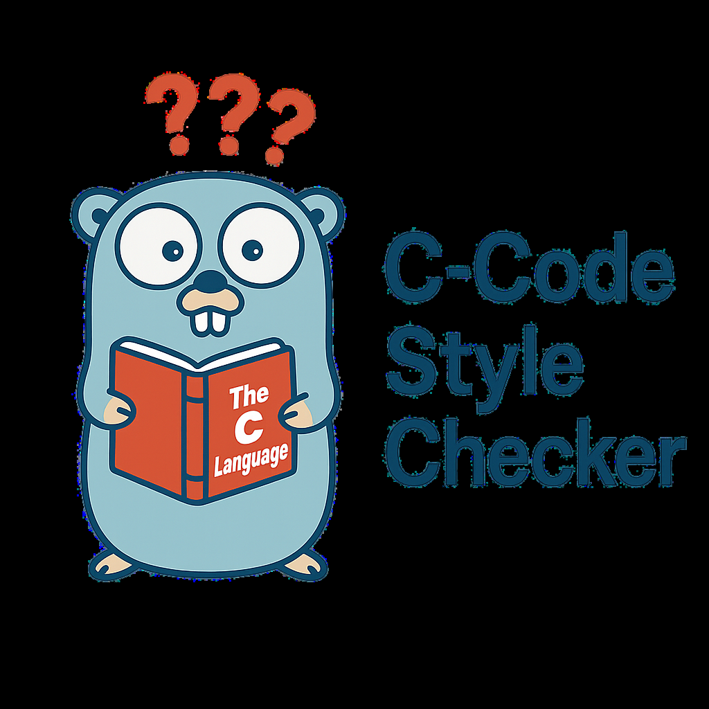

<a id="readme-top"></a>

<div align="center">

  [![Contributors][contributors-shield]][contributors-url]
  [![Forks][forks-shield]][forks-url]
  [![Stargazers][stars-shield]][stars-url]
  [![Issues][issues-shield]][issues-url]
  [![ULicense][license-shield]][license-url]
  [![LinkedIn][linkedin-shield]][linkedin-url]
  
</div>

##

<p align="center">
  
</p>

##

<div align="center">
  by: Rafael V. Volkmer - @RafaelVVolkmer - rafael.v.volkmer@gmail.com
</div>

##
# - Project Description

CodeStyleChecker is a lightweight, Go-powered style checker focused on C source files and headers. It parses files and flags spacing, brace style, naming, and other formatting violations against K&R and Allman conventions, emitting machine-readable reports for automated pipelines. The repo includes a simple checker.sh CLI wrapper with verbose and JSON-report modes so you can either print human-friendly findings or dump pretty, per-error JSON artifacts (saved under ./out/ with timestamped filenames). The core checker lives in src/ (Go ~96%) with a small shell glue layer, and the tree ships with a GitHub Actions workflow so the checks can run on every push/PR. In short: point it at a file or directory, select your style, and get consistent, automatable feedback you can wire into CI without external dependencies. 

<p align="right">(<a href="#readme-top">back to top</a>)</p>

---

# - Repository tree

```python
/libmemalloc
├── /src
│   └── check_style.go
├── /readme
│    └── c_style_checker.svg
├── Dockerfile
├── .dockerignore
├── checker.sh
├── .gitattributes
├── .gitignore
├── LICENSE
└── README.md
```

---

# - Build and Use

### Clone the repository

```bash
git clone https://github.com/RafaelVVolkmer/CodeStyleChecker.git CodeStyleChecker
cd CodeStyleChecker
```

### Local build

```bash
# Make the checker script executable
chmod +x checker.sh

# Build the Go binary (done automatically when running checker.sh)
./checker.sh -r allman main.c

# Or rebuild only without running checks
./checker.sh --rebuild-only
```

<p align="right">(<a href="#readme-top">Back to Top</a>)</p>

---

# - Tech Stack and Environment Settings

| **Category**               | **Technologies and Tools**                                                                                                                                                                                                                                  |
| -------------------------- | -------------------------------------------------------------------------------------------------------------------------------------------------------------------------------------------------------------------------------------------------------------- |
| **Programming Languages**  |                                                                                                                                                                 |
| **Build System**           |                                                                                                                                                       |
| **Version Control**        |                                              |
| **Documentation**          |                                         |
| **Support Tools**          |                                                                                                                                                     |
| **Operating System**       |                                                                                                                                                            |
| **IDE**                    |                                                                                                                                                      |

<p align="right">(<a href="#readme-top">Back to Top</a>)</p>

---
| Title                                                                            | Author / Year                                                         |
| -------------------------------------------------------------------------------- | --------------------------------------------------------------------- |
| **Introducing Go: Build Reliable, Scalable Programs**                            | by: Caleb Doxsey, 2016                                                |
| **Mastering Regular Expressions**                                                | by: Jeffrey E. F. Friedl, 2006                                        |
| **Lex & Yacc**                                                                   | by: John R. Levine, Tony Mason, Doug Brown, 1992                      |
| **The Go Programming Language**                                                  | by: Alan A. A. Donovan, Brian W. Kernighan, 2015                      |
| **Building Tools with Go: Writing linters, formatters, and code analysis tools** | by: John Arundel, 2021                                                |
| **Compilers: Principles, Techniques, and Tools (2nd Edition)**                   | by: Alfred V. Aho, Monica S. Lam, Ravi Sethi, Jeffrey D. Ullman, 2006 |
| **Writing An Interpreter In Go**                                                 | by: Thorsten Ball, 2017                                               |
| **Go AST Package Documentation** (golang.org/pkg/go/ast)                         | Go Authors, ongoing                                                   |


<p align="right">(<a href="#readme-top">back to top</a>)</p>

[maintainability-shield]: https://qlty.sh/gh/RafaelVVolkmer/projects/CodeStyleChecker/badges/maintainability.svg?style=flat-square
[maintainability-url]:   https://qlty.sh/gh/RafaelVVolkmer/projects/CodeStyleChecker
[stars-shield]: https://img.shields.io/github/stars/RafaelVVolkmer/CodeStyleChecker.svg?style=flat-square
[stars-url]: https://github.com/RafaelVVolkmer/CodeStyleChecker/stargazers
[contributors-shield]: https://img.shields.io/github/contributors/RafaelVVolkmer/CodeStyleChecker.svg?style=flat-square
[contributors-url]: https://github.com/RafaelVVolkmer/CodeStyleChecker/graphs/contributors
[forks-shield]: https://img.shields.io/github/forks/RafaelVVolkmer/CodeStyleChecker.svg?style=flat-square
[forks-url]: https://github.com/RafaelVVolkmer/CodeStyleChecker/network/members
[issues-shield]: https://img.shields.io/github/issues/RafaelVVolkmer/CodeStyleChecker.svg?style=flat-square
[issues-url]: https://github.com/RafaelVVolkmer/CodeStyleChecker/issues
[linkedin-shield]: https://img.shields.io/badge/-LinkedIn-black.svg?style=flat-square&logo=linkedin&colorB=555
[linkedin-url]: https://www.linkedin.com/in/rafaelvvolkmer
[license-shield]: https://img.shields.io/github/license/RafaelVVolkmer/CodeStyleChecker.svg?style=flat-square
[license-url]: https://github.com/RafaelVVolkmer/CodeStyleChecker/blob/main/LICENSE.txt
